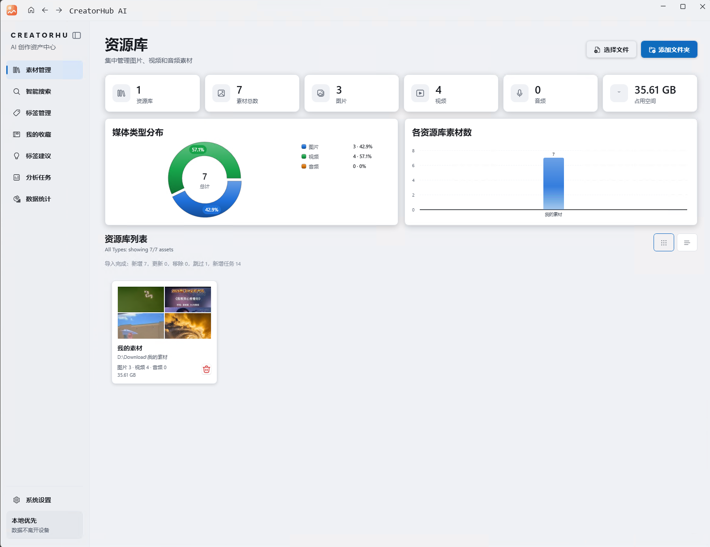
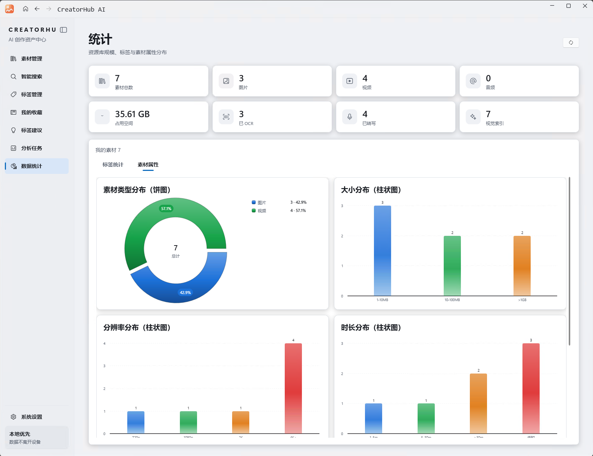
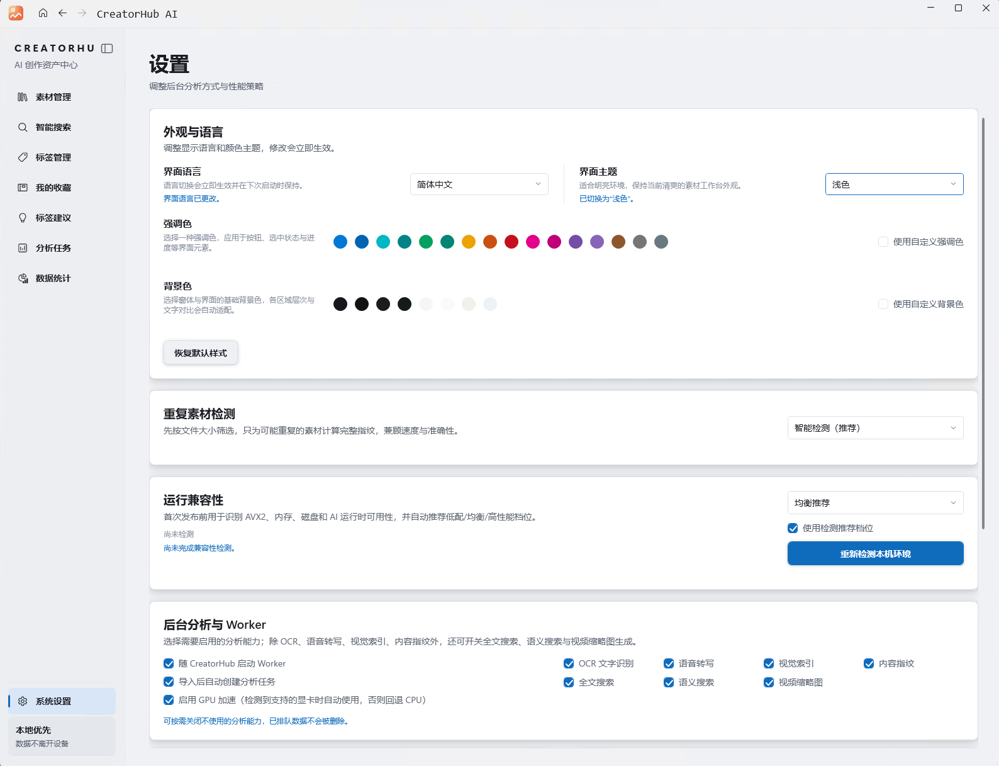

# CreatorHub AI · 创库 AI

> 本地优先的 AI 素材管理工具 —— 让图片、视频、音频素材"开口说话"。

## ✨ 项目介绍

CreatorHub AI 是一款 **完全本地离线** 的 AI 创作资产管理工具：导入素材文件夹后，应用自动在本地为每份素材建立 AI 索引（OCR 文字识别、语音转写、视觉语义理解），之后用一句自然语言即可在数万级素材中精准找到目标。

**核心原则：你的素材留在你的硬盘上，AI 在你身边离线工作。**

- 🛡️ **本地优先**：OCR / 语音转写 / 语义搜索全部本地运行，素材原文件零修改、零上传
- 🔍 **智能搜索**：支持按画面、文字、语音内容搜索素材（10 万级素材 P95 检索 < 30ms）
- 🖼️ **视觉理解**：以图搜图、画面语义标签（中文 CLIP）
- 🎙️ **语音转写**：Whisper 本地转写，视频/音频内容可搜索
- 📁 **多库管理**：文件夹级资源库，集中管理图片、视频、音频
- 💾 **完全离线**：无账号依赖，单机可用；可选的联网功能仅为激活与更新

## 📸 界面预览

| 素材管理 | 数据统计 | 系统设置 |
|---|---|---|
|  |  |  |

## ⚙️ 环境要求

- Windows 10 / 11（x64）
- .NET 8 桌面运行时

## 📥 下载与安装

前往 [Releases](https://github.com/davidboy8716/CreatorAsset/releases) 下载最新测试包：

1. 下载 \creatorhub-*.zip\ 并解压；
2. 运行 \pp\CreatorHub.App.exe\；
3. SmartScreen 提示时选择「更多信息 → 仍要运行」（测试包未签名）；
4. 首次启动如需 AI 运行时，运行 \install-prerequisites.cmd\。

> 当前仓库发布的是**公开测试版**（免激活、功能完整）；正式商业版请访问官网。

## 🐛 反馈

问题与建议请提交 [Issues](https://github.com/davidboy8716/CreatorAsset/issues)，欢迎附上截图与复现步骤。
